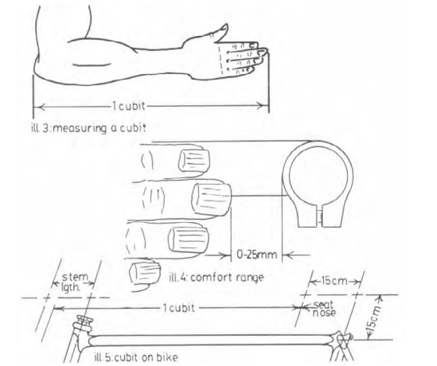
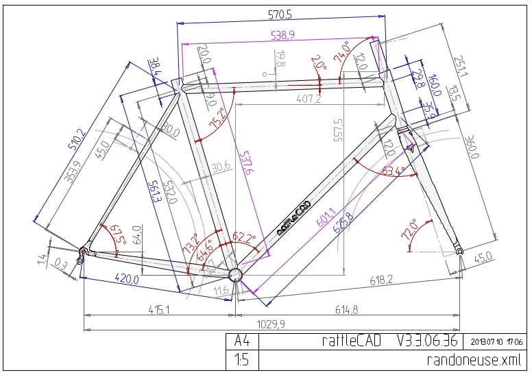
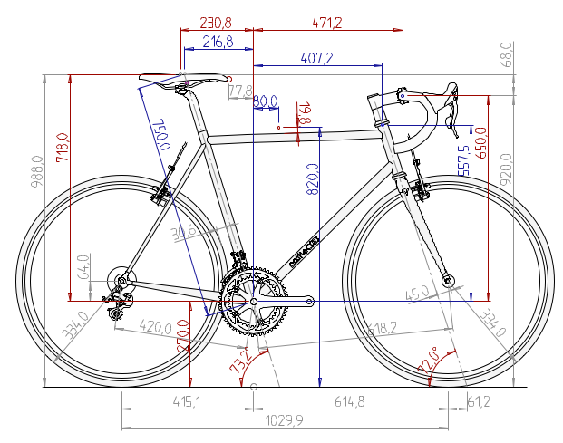
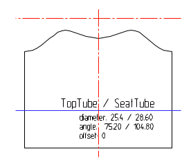

Bicycle
=======

I have so much pleasure riding my own handmade bicycle that I want to share the way I did it.

### Design a bike that fits your body

Framebuilding isn't knew and some books are explaining the process. Among them, the [patereck](http://www.amazon.com/The-Paterek-manual-bicycle-framebuilders/dp/B000711OC0) which can be find free of charge [here](http://www.timpaterek.com/paterek.pdf), is the one I used. 



It explains all the rules needed to match the size of your frame to the size of your body. 
To facilitate the process, I have written all the measures you need inside a little python script called `patereck.py` available in this repo:

```python
#### parameters to choose:
##### rider
A = 82 # inseam height
cubit = 46 # from elbow to nails, hand opened
TM = 67 # torso measurment
AM = 66 # arm measurment

##### bike
B = 27 # bottom braket height in cm
C = 4 # crotch clearance (4cm for touting 6cm for racing)
E = radians(73.2) # seat tube angle
HTA = radians(72) # head tube angle:70:resilient and confort (touring) 75: stiff (race)
FR = 4.5 # fork rake: + for touring - for race
R = 33.4 # wheel radius
```

once you run it using `python patereck.py` you'll find all the measurements you need:

```
Down Tube : 51
Seat Tube : 53.273750437
Top Tube : 54.3
========== checks ===========
Stem from torso: 3.52608695652
Stem form cubit: 9.2
Trail (5 to 7):  6.12073784511
Front center (around 58)
chainstay (40 for race to 47 for touring
check clearance
```

there are two ways to compute the stem and I guess I misunderstood one because both don't give me the same result. I chose the one derived from the cubit.

Once you've got these measurments, download [RattleCad](http://rattlecad.sourceforge.net/) which is a free, open source version of BikeCad. It is far from being perfect but it does the work for the frame ajustments and mitering:




The mitering is particularly usefull as if you take care of **printing these images without resizing**, you'll just have to cut them and round them on your tube to cut them properly.




## Building

And now you're ready to do real stuff:
















